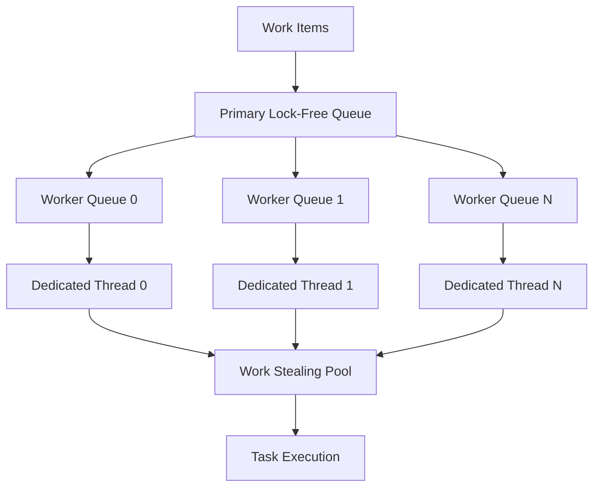
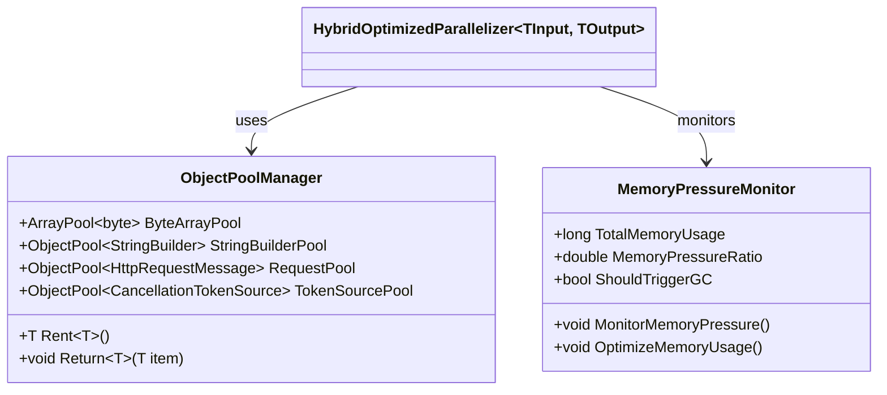
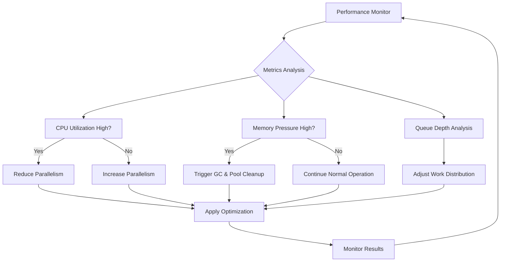
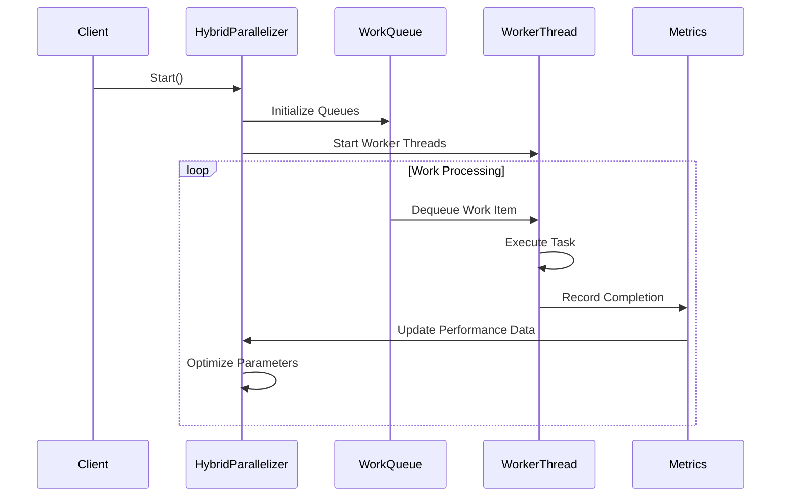
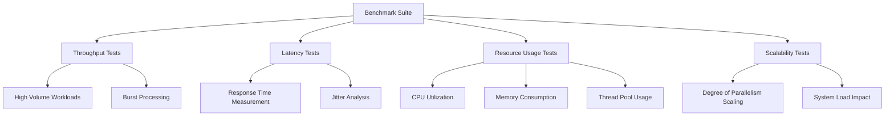
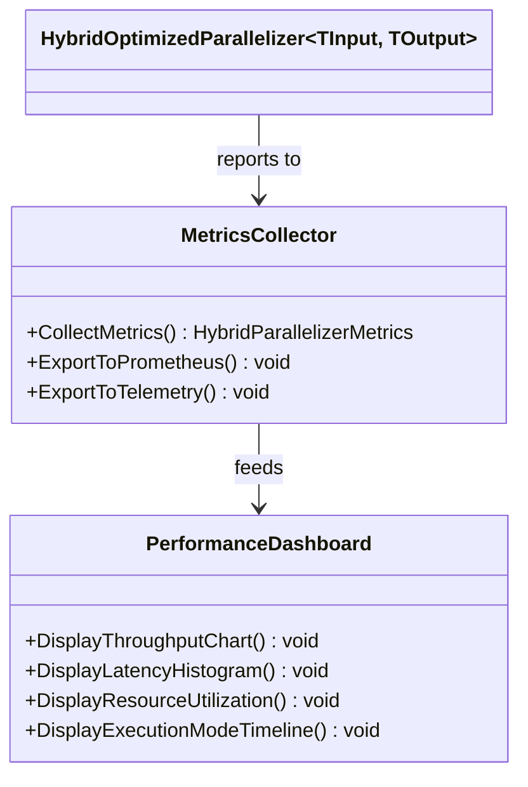
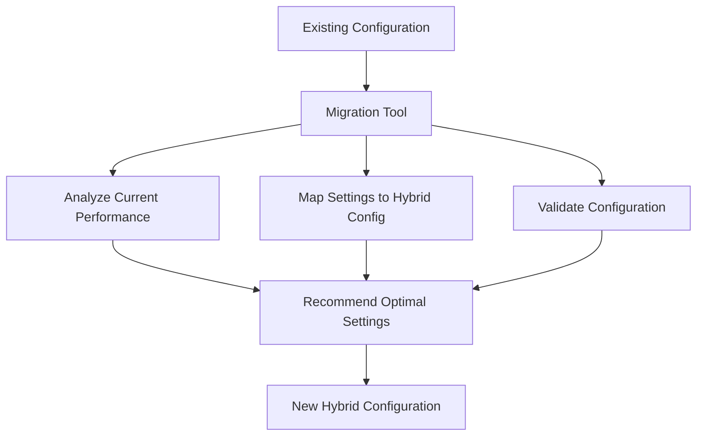

# HybridOptimizedParallelizer Design

## Overview

The HybridOptimizedParallelizer is designed as the fourth and most advanced parallelizer option for OpenBullet2 Native automation, combining the best features of existing parallelizers with cutting-edge optimization techniques. This parallelizer aims to deliver maximum throughput, minimal latency, and optimal resource utilization for high-performance automation workloads.

## Architecture

### Core Design Philosophy

The HybridOptimizedParallelizer adopts a hybrid approach that intelligently combines multiple parallelization strategies based on workload characteristics and system resources. It dynamically adapts its execution strategy to achieve optimal performance across different automation scenarios.

```mermaid
classDiagram
    class HybridOptimizedParallelizer~TInput, TOutput~ {
        -WorkStealingTaskScheduler _taskScheduler
        -LockFreeWorkQueue~TInput~ _primaryQueue
        -List~LockFreeWorkQueue~TInput~~ _workerQueues
        -Thread[] _dedicatedThreads
        -SemaphoreSlim _adaptiveSemaphore
        -AdaptiveMetrics _metrics
        -HybridExecutionMode _currentMode
        +Start() Task
        +Pause() Task
        +Resume() Task
        +Stop() Task
        +Abort() Task
        +ChangeDegreeOfParallelism(int) Task
        -AdaptiveWorkDistribution() Task
        -WorkStealingWorkerLoop(int) void
        -OptimizeExecutionMode() void
        -DynamicLoadBalancing() void
    }
    
    class LockFreeWorkQueue~T~ {
        -ConcurrentQueue~T~ _queue
        -volatile int _count
        +TryEnqueue(T) bool
        +TryDequeue(out T) bool
        +Count int
    }
    
    class AdaptiveMetrics {
        +long CompletionRate
        +double AverageExecutionTime
        +int QueueDepth
        +double CPUUtilization
        +double MemoryPressure
        +HybridExecutionMode RecommendedMode
    }
    
    enum HybridExecutionMode {
        HighThroughput
        LowLatency
        Balanced
        CPUIntensive
        IOBound
    }
    
    Parallelizer~TInput, TOutput~ <|-- HybridOptimizedParallelizer~TInput, TOutput~
    HybridOptimizedParallelizer~TInput, TOutput~ --> LockFreeWorkQueue~TInput~ : uses
    HybridOptimizedParallelizer~TInput, TOutput~ --> AdaptiveMetrics : monitors
```

### Key Features

#### 1. Adaptive Execution Modes
The parallelizer automatically switches between execution modes based on real-time metrics:

- **HighThroughput**: Maximum parallelism for bulk operations
- **LowLatency**: Minimized response time for interactive scenarios  
- **Balanced**: Optimal resource utilization for general use
- **CPUIntensive**: Optimized for compute-heavy automation tasks
- **IOBound**: Specialized for network-intensive operations

#### 2. Lock-Free Work Distribution
Implements lock-free data structures to eliminate contention:



#### 3. Work-Stealing Algorithm
Advanced work-stealing mechanism ensures optimal load distribution:

- Each worker thread maintains its own work queue
- Idle threads steal work from busy threads' queues
- Dynamic load balancing based on queue depths
- NUMA-aware thread placement for multi-socket systems

## Technical Implementation

### Core Components

#### Work-Stealing Task Scheduler
```csharp
public class WorkStealingTaskScheduler : TaskScheduler
{
    private readonly Thread[] _threads;
    private readonly LockFreeWorkQueue<Task>[] _queues;
    private readonly int _concurrencyLevel;
    
    protected override void QueueTask(Task task)
    {
        var threadIndex = Thread.CurrentThread.ManagedThreadId % _concurrencyLevel;
        _queues[threadIndex].TryEnqueue(task);
    }
    
    private void WorkerThreadProc(int index)
    {
        var localQueue = _queues[index];
        
        while (!_cancellationToken.IsCancellationRequested)
        {
            if (!localQueue.TryDequeue(out var task))
            {
                // Work stealing logic
                task = StealWork(index);
            }
            
            if (task != null)
            {
                TryExecuteTask(task);
            }
        }
    }
}
```

#### Lock-Free Work Queue
```csharp
public class LockFreeWorkQueue<T>
{
    private readonly ConcurrentQueue<T> _queue = new();
    private volatile int _count;
    
    public bool TryEnqueue(T item)
    {
        _queue.Enqueue(item);
        Interlocked.Increment(ref _count);
        return true;
    }
    
    public bool TryDequeue(out T item)
    {
        if (_queue.TryDequeue(out item))
        {
            Interlocked.Decrement(ref _count);
            return true;
        }
        return false;
    }
    
    public int Count => _count;
}
```

#### Adaptive Metrics Collection
```csharp
public class AdaptiveMetrics
{
    private readonly ConcurrentQueue<long> _completionTimestamps = new();
    private readonly PerformanceCounter _cpuCounter;
    private readonly PerformanceCounter _memoryCounter;
    
    public void RecordCompletion(TimeSpan executionTime)
    {
        _completionTimestamps.Enqueue(Environment.TickCount64);
        UpdateAverageExecutionTime(executionTime);
    }
    
    public HybridExecutionMode RecommendedMode
    {
        get
        {
            var cpuUtilization = CPUUtilization;
            var avgExecTime = AverageExecutionTime;
            var queueDepth = QueueDepth;
            
            return (cpuUtilization, avgExecTime, queueDepth) switch
            {
                ( > 0.8, < 50, _) => HybridExecutionMode.CPUIntensive,
                ( < 0.3, > 200, _) => HybridExecutionMode.IOBound,
                (_, _, > 1000) => HybridExecutionMode.HighThroughput,
                (_, < 10, _) => HybridExecutionMode.LowLatency,
                _ => HybridExecutionMode.Balanced
            };
        }
    }
}
```

### Memory Optimization Strategies

#### Object Pooling


#### NUMA Topology Awareness
```csharp
public class NUMATopologyManager
{
    private readonly Dictionary<int, int> _threadToNodeMapping;
    private readonly int[] _nodeProcessorCounts;
    
    public int GetOptimalNode(int threadId)
    {
        return _threadToNodeMapping.GetValueOrDefault(threadId, 0);
    }
    
    public void SetThreadAffinity(int threadId, int numaNode)
    {
        var processor = GetProcessorForNode(numaNode, threadId);
        SetThreadAffinityMask(threadId, 1UL << processor);
    }
}
```

### Dynamic Optimization Features

#### Real-Time Performance Tuning


#### Predictive Scaling
```csharp
public class PredictiveScaler
{
    private readonly Queue<double> _throughputHistory = new();
    private readonly LinearRegression _trendAnalyzer = new();
    
    public int PredictOptimalParallelism()
    {
        var trend = _trendAnalyzer.CalculateTrend(_throughputHistory);
        var baseParallelism = Environment.ProcessorCount;
        
        return trend switch
        {
            > 0.1 => Math.Min(baseParallelism * 2, MaxDegreeOfParallelism),
            < -0.1 => Math.Max(baseParallelism / 2, 1),
            _ => baseParallelism
        };
    }
}
```

## Performance Characteristics

### Throughput Optimization

#### Burst Mode Processing


#### Latency Minimization
- Pre-allocated thread pools to eliminate startup overhead
- Lock-free data structures for zero-contention access
- CPU cache-friendly data layouts
- Branch prediction optimization through profiling

### Resource Utilization

#### CPU Efficiency
```csharp
public class CPUOptimizer
{
    public void OptimizeCPUUsage()
    {
        var coreCount = Environment.ProcessorCount;
        var targetUtilization = 0.85; // 85% target utilization
        
        if (CurrentCPUUtilization > targetUtilization)
        {
            ReduceActiveThreads();
        }
        else if (CurrentCPUUtilization < targetUtilization * 0.7)
        {
            IncreaseActiveThreads();
        }
    }
    
    private void SetThreadPriority(int threadId, ThreadPriority priority)
    {
        // Platform-specific thread priority optimization
    }
}
```

#### Memory Efficiency
- Generational garbage collection optimization
- Large object heap management
- Memory-mapped file support for large datasets
- Compressed work item serialization

## Integration with OpenBullet2 Native

### Configuration API
```csharp
public class HybridParallelizerConfig
{
    public int InitialDegreeOfParallelism { get; set; } = Environment.ProcessorCount;
    public HybridExecutionMode PreferredMode { get; set; } = HybridExecutionMode.Balanced;
    public bool EnableWorkStealing { get; set; } = true;
    public bool EnableNUMAAware { get; set; } = true;
    public bool EnablePredictiveScaling { get; set; } = true;
    public TimeSpan MetricsCollectionInterval { get; set; } = TimeSpan.FromSeconds(1);
    public double CPUUtilizationTarget { get; set; } = 0.85;
    public long MemoryPressureThreshold { get; set; } = 1024 * 1024 * 1024; // 1GB
}
```

### Factory Integration
```csharp
public static class ParallelizerFactory<TInput, TOutput>
{
    public static Parallelizer<TInput, TOutput> Create(ParallelizerType type,
        IEnumerable<TInput> workItems, 
        Func<TInput, CancellationToken, Task<TOutput>> workFunction,
        int degreeOfParallelism, long totalAmount, int skip = 0, 
        int maxDegreeOfParallelism = 200)
    {
        return type switch
        {
            ParallelizerType.TaskBased => new TaskBasedParallelizer<TInput, TOutput>(...),
            ParallelizerType.ThreadBased => new ThreadBasedParallelizer<TInput, TOutput>(...),
            ParallelizerType.ParallelBased => new ParallelBasedParallelizer<TInput, TOutput>(...),
            ParallelizerType.HybridOptimized => new HybridOptimizedParallelizer<TInput, TOutput>(...),
            _ => throw new NotImplementedException(),
        };
    }
}
```

## Testing Strategy

### Performance Benchmarks


### Unit Testing Framework
```csharp
[TestClass]
public class HybridOptimizedParallelizerTests
{
    [TestMethod]
    public async Task Should_Outperform_ExistingParallelizers()
    {
        var workItems = GenerateTestWorkload(10000);
        var workFunction = CreateMockWorkFunction();
        
        var results = await BenchmarkAllParallelizers(workItems, workFunction);
        
        Assert.IsTrue(results.HybridOptimized.Throughput > results.TaskBased.Throughput);
        Assert.IsTrue(results.HybridOptimized.Throughput > results.ThreadBased.Throughput);
        Assert.IsTrue(results.HybridOptimized.Throughput > results.ParallelBased.Throughput);
    }
    
    [TestMethod]
    public async Task Should_Adapt_To_Workload_Changes()
    {
        var parallelizer = CreateHybridParallelizer();
        
        await parallelizer.Start();
        
        // Simulate workload changes and verify adaptation
        var initialMode = parallelizer.CurrentExecutionMode;
        
        SimulateCPUIntensiveWorkload();
        await Task.Delay(5000); // Allow adaptation time
        
        Assert.AreEqual(HybridExecutionMode.CPUIntensive, parallelizer.CurrentExecutionMode);
    }
}
```

## Monitoring and Observability

### Metrics Collection
```csharp
public class HybridParallelizerMetrics
{
    public long TotalItemsProcessed { get; set; }
    public double AverageThroughput { get; set; }
    public TimeSpan AverageLatency { get; set; }
    public double CPUUtilization { get; set; }
    public long MemoryUsage { get; set; }
    public int ActiveThreadCount { get; set; }
    public HybridExecutionMode CurrentMode { get; set; }
    public Dictionary<string, object> CustomMetrics { get; set; }
}
```

### Real-Time Dashboard Integration


## Migration Guide

### From Existing Parallelizers
```csharp
// Before: TaskBasedParallelizer
var oldParallelizer = ParallelizerFactory<string, Result>.Create(
    ParallelizerType.TaskBased,
    workItems, workFunction, degreeOfParallelism, totalAmount);

// After: HybridOptimizedParallelizer
var newParallelizer = ParallelizerFactory<string, Result>.Create(
    ParallelizerType.HybridOptimized,
    workItems, workFunction, degreeOfParallelism, totalAmount);

// Optional: Configure advanced features
if (newParallelizer is HybridOptimizedParallelizer<string, Result> hybrid)
{
    hybrid.ConfigureOptimizations(new HybridParallelizerConfig
    {
        PreferredMode = HybridExecutionMode.HighThroughput,
        EnableWorkStealing = true,
        EnablePredictiveScaling = true
    });
}
```

### Configuration Migration
