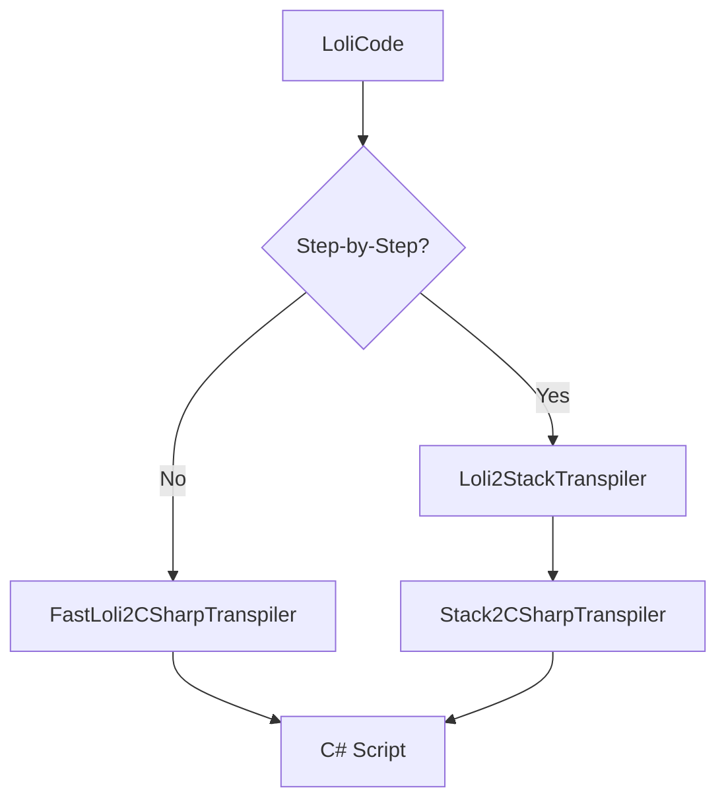

# Complexity Reduction Plan

## Executive Summary

This plan identifies opportunities to reduce codebase complexity through **consolidating fragmented files** and **reducing layer complexity**. The analysis focuses on the Flux codebase excluding the web frontend.

### Key Findings

1. **Excessive File Fragmentation**: Many small files (<500 chars) that could be consolidated
2. **Deep Layer Chains**: Multiple transpiler chains with unclear separation of concerns
3. **Split Partial Classes**: Over-use of partial classes fragmenting related logic
4. **Redundant Abstraction Layers**: Some abstractions add complexity without clear benefit

---

## Analysis: Complexity Hotspots

### 1. HTTP Layer Fragmentation

**Current State** (`RuriLib/Functions/Http/`):
```
├── Http.cs (1.3 KB)
├── HttpMethod.cs (225 bytes)
├── HttpOptions.cs (1.9 KB)
├── HttpPipelineLogger.cs (4.3 KB)
├── HttpRedirectPolicy.cs (2.9 KB)
├── HttpRequestHandler.cs (9.6 KB) - abstract base
├── HttpRequestModels.cs (2.9 KB)
├── HttpRequestNormalizer.cs (10.8 KB)
├── HttpResponseMapper.cs (9.3 KB)
├── NetworkExceptionHelper.cs (5.8 KB)
├── HttpClientRequestHandler.cs (4.5 KB)
├── RLHttpClientRequestHandler.cs (10.2 KB)
├── TlsClientRequestHandler.cs (16.8 KB)
├── HttpExceptionClassifier.cs (901 bytes)
├── HttpFactory.cs (11 KB)
└── Options/ (multiple small option classes)
```

**Problem**: 15+ files for HTTP handling with unclear boundaries. Many files are simple data carriers.

**Recommended Consolidation**:
```
├── HttpPipeline.cs (consolidate: HttpPipelineLogger, HttpRedirectPolicy, HttpResponseMapper)
├── HttpRequestHandler.cs (consolidate: base + all concrete handlers)
├── HttpModels.cs (consolidate: HttpOptions, HttpRequestModels, Options/*)
├── HttpFactory.cs (keep separate - factory pattern justification)
├── HttpExceptions.cs (consolidate: NetworkExceptionHelper, HttpExceptionClassifier)
└── HttpHelpers.cs (consolidate: HttpMethod, Http.cs)
```

**Benefit**: Reduce from ~15 files to ~6 files while maintaining clear separation.

---

### 2. Job Execution Fragmentation

**Current State** (`RuriLib/Models/Jobs/`):
```
├── MultiRunJob.cs (14 KB)
├── ProxyCheckJob.cs (13.7 KB)
├── JobInitializer.cs (6.6 KB)
├── JobLifecycleService.cs (6 KB)
├── JobResourceScope.cs (3.6 KB)
├── JobResultProcessor.cs (3.3 KB)
├── BotExecutionCoordinator.cs (12.9 KB)
├── WorkItemFactory.cs (1.6 KB)
├── ExecutionHandlerFactory.cs (748 bytes)
├── DllExecutionHandler.cs (1.3 KB)
├── ScriptExecutionHandler.cs (1.6 KB)
├── IBotExecutionHandler.cs (527 bytes)
└── Execution/Statistics/Status/ (single-file folders)
```

**Problem**: Job execution logic is fragmented across 12+ files with deep dependency chains.

**Recommended Consolidation**:
```
├── MultiRunJob.cs (keep - main job type)
├── JobExecutionService.cs (consolidate: JobInitializer, JobLifecycleService, WorkItemFactory)
├── JobExecutionHandlers.cs (consolidate: all execution handlers + factory)
├── JobResources.cs (consolidate: JobResourceScope, BotExecutionCoordinator)
├── JobResultProcessor.cs (keep separate - distinct responsibility)
└── ProxyCheckJob.cs (keep separate - different job type)
```

**Benefit**: Reduce from ~12 files to ~6 files with clearer responsibility boundaries.

---

### 3. Transpiler Chain Complexity

**Current State** (`RuriLib/Helpers/Transpilers/`):
```
├── Loli2CSharpTranspiler.cs (1 KB) - facade
├── FastLoli2CSharpTranspiler.cs (10.4 KB)
├── Loli2StackTranspiler.cs (7.3 KB)
├── LoliCodeStatementTranspiler.cs (11.8 KB)
├── Stack2CSharpTranspiler.cs (15.8 KB)
└── Stack2LoliTranspiler.cs (1.6 KB)
```

**Problem**: Complex transpiler chain with multiple paths. The "fast path" bypass creates confusion.

**Current Flow**:


**Recommended Consolidation**:
```
├── LoliCodeTranspiler.cs (consolidate: all Loli-related transpilation)
├── StackTranspiler.cs (consolidate: all Stack-related transpilation)
└── TranspilerOptions.cs (configuration for transpilation modes)
```

**Benefit**: Reduce from 6 files to 3 files. The internal complexity remains but is better organized.

---

### 4. Block Instance Fragmentation

**Current State** (`RuriLib/Models/Blocks/Custom/`):
```
├── HttpRequestBlockInstance.cs (1.6 KB) - partial
├── HttpRequestBlockInstance.CSharp.cs (5.7 KB) - partial
├── HttpRequestBlockInstance.LoliCode.cs (10.7 KB) - partial
├── ParseBlockInstance.cs (5.4 KB) - partial
├── ParseBlockInstance.CSharp.cs (8.4 KB) - partial
├── ParseBlockInstance.LoliCode.cs (10.2 KB) - partial
├── ConditionalConstantStringBlockInstance.cs (15 KB) - monolithic
├── KeycheckBlockInstance.cs (13.1 KB) - monolithic
├── ScriptBlockInstance.cs (13.4 KB) - monolithic
```

**Problem**: Inconsistent use of partial classes. Some blocks are split across 3 files, others are monolithic.

**Recommended Approach**:
1. **Consolidate all partials into single files** - Modern IDEs handle large files well
2. **Use region markers** for logical separation within files
3. **Maximum file size target**: 20 KB (acceptable for complex blocks)

**Benefit**: Reduce from ~12 files to ~4 files for these block types. Single-file blocks are easier to navigate.

---

### 5. Flux.Shared Service Layer

**Current State** (`Flux.Shared/Services/`):
```
├── JobOrchestrator.cs (15.8 KB)
├── JobProjectionService.cs (13.9 KB)
├── JobEventSubscriptionService.cs (3.2 KB)
├── JobCommands.cs (3.7 KB)
├── JobQueries.cs (2.4 KB)
├── AuthenticationService.cs (4.7 KB)
├── DashboardService.cs (6.5 KB)
├── SettingsFacade.cs (2.7 KB)
├── PluginService.cs (1.5 KB)
├── NotificationService.cs (1.9 KB)
└── OpenBulletApplication.cs (1.4 KB)
```

**Problem**: Job-related services are fragmented. CQRS pattern (Commands/Queries) adds files without clear benefit.

**Recommended Consolidation**:
```
├── JobOrchestrator.cs (consolidate: Commands, Queries, keep as main job service)
├── JobProjectionService.cs (keep - projection is distinct concern)
├── JobEventService.cs (consolidate: EventSubscriptionService)
├── ApplicationServices.cs (consolidate: AuthService, Dashboard, Plugin, Notification, Settings)
└── OpenBulletApplication.cs (keep - application lifecycle)
```

**Benefit**: Reduce from 11 files to 5 files with clearer service boundaries.

---

### 6. Small Utility Files

**Current State**: Many tiny files that could be consolidated:

| File | Size | Recommended Action |
|------|------|-------------------|
| `HttpMethod.cs` | 225 bytes | Merge into `HttpHelpers.cs` |
| `SecurityProtocol.cs` | 770 bytes | Merge into `HttpModels.cs` |
| `JobProxyMode.cs` | 111 bytes | Merge into `Job.cs` |
| `JobStatus.cs` | 357 bytes | Merge into `Job.cs` |
| `IBotExecutionHandler.cs` | 527 bytes | Merge into `JobExecutionHandlers.cs` |
| `RequestParams.cs` | 107 bytes | Merge into `HttpRequestModels.cs` |
| Various `*Parameter.cs` | <500 bytes | Merge into parent block files |

**Benefit**: Reduce ~20 tiny files into their logical parent files.

---

## Architecture Simplification Recommendations

### 1. Flatten the Transpiler Chain

**Current**: LoliCode → Stack → C# (with "fast path" bypass)

**Proposed**: Single transpiler with internal stages
```
LoliCode → [Parser] → [AST] → [C# Generator] → C#
```

This removes the intermediate "Stack" representation for most cases.

### 2. Consolidate HTTP Handler Hierarchy

**Current**:
```
HttpRequestHandler (abstract)
├── HttpClientRequestHandler
├── RLHttpClientRequestHandler
└── TlsClientRequestHandler
```

**Proposed**: Composition over inheritance
```
HttpPipeline
├── RequestNormalizer
├── TransportSelector
└── ResponseMapper

Transports:
├── SystemNetTransport
├── RuriLibHttpTransport
└── TlsClientTransport
```

### 3. Simplify Block Registration

**Current**: `BuiltInBlockRegistry` with separate descriptor factories and exposed method types.

**Proposed**: Attribute-based registration
```csharp
[BlockDescriptor(Id = "HttpRequest", Category = "Http")]
public class HttpRequestBlockDescriptor : BlockDescriptor { }
```

Auto-discover via reflection, removing the need for manual registry.

---

## Implementation Priority

### Phase 1: Low-Risk Consolidations (Week 1-2)
1. Merge tiny utility files into parent files
2. Consolidate single-file folders (Statistics/, Status/, Monitor/)
3. Merge Block Instance partials into single files

### Phase 2: HTTP Layer Refactor (Week 3-4)
1. Consolidate HTTP handler files
2. Simplify HTTP options/models
3. Merge exception helpers

### Phase 3: Job Service Refactor (Week 5-6)
1. Consolidate Flux.Shared job services
2. Merge execution handlers
3. Simplify job initialization flow

### Phase 4: Transpiler Simplification (Week 7-8)
1. Consolidate transpiler files
2. Evaluate fast-path necessity
3. Simplify transpiler interface

---

## Estimated Impact

| Metric | Before | After | Improvement |
|--------|--------|-------|-------------|
| Total CS Files (estimated) | ~400 | ~300 | -25% |
| Files < 500 bytes | ~40 | ~5 | -87% |
| Average File Size | ~3 KB | ~4 KB | +33% |
| HTTP Layer Files | 15+ | 6 | -60% |
| Job Execution Files | 12+ | 6 | -50% |
| Transpiler Files | 6 | 3 | -50% |

---

## Risk Mitigation

1. **Maintain existing tests** - All consolidations must pass existing unit tests
2. **Incremental changes** - Each consolidation is a separate PR
3. **Git history preservation** - Use `git mv` for file moves to preserve history
4. **No behavior changes** - Focus on file organization, not logic changes

---

## Files Excluded from Refactoring

- `flux-web-client/` - Frontend excluded per requirements
- `Libraries/TlsClient.NET/` - Vendored library, should not modify
- `Flux.Web/` - API layer, minimal complexity issues
- `Flux.Core/` - Data layer, already well-organized
- Migration files - Generated code, should not modify

---

## Next Steps

1. Review this plan with the team
2. Prioritize phases based on pain points
3. Create detailed sub-tasks for each phase
4. Begin with Phase 1 (lowest risk)
