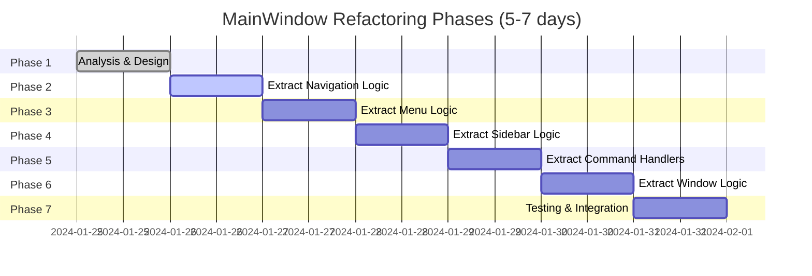

# Monster File Refactoring Plan
## Breaking Down MainWindow.xaml.cs (799 lines)

**Goal:** Break down the oversized [`MainWindow.xaml.cs`](OpenBullet2.Native/MainWindow.xaml.cs:1) into manageable, focused pieces while maintaining functionality and improving maintainability.

**Target File:** [`OpenBullet2.Native/MainWindow.xaml.cs`](OpenBullet2.Native/MainWindow.xaml.cs:1) (799 lines)

---

## Phase Overview



---

## Current File Analysis

### Identified Responsibilities in MainWindow.xaml.cs

| Responsibility | Lines | Complexity | Priority |
|----------------|--------|-------------|-----------|
| Navigation & Page Management | 227-350 | High | P0 |
| Command Bindings & Handlers | 421-508 | Medium | P1 |
| Sidebar Toggle & Animation | 533-665 | High | P1 |
| Dropdown Submenu Logic | 667-711 | Medium | P2 |
| Window State Management | 183-225, 517-531 | Medium | P1 |
| Accessibility Settings | 713-797 | Low | P2 |
| Responsive Design | 181-217 | Medium | P2 |
| Menu Highlight Logic | 244-308 | Low | P2 |

### Dependencies
- [`INavigationService`](OpenBullet2.Native/Services/NavigationService.cs:31)
- [`MainWindowViewModel`](OpenBullet2.Native/ViewModels/MainWindowViewModel.cs)
- [`HotkeyService`](OpenBullet2.Native/Services/HotkeyService.cs)
- [`IThemeService`](OpenBullet2.Native/Services/IThemeService.cs)
- [`IWindowLayoutService`](OpenBullet2.Native/Services/WindowLayoutService.cs)
- [`ConfigEditor`](OpenBullet2.Native/Views/Pages/Configs/ConfigEditor.xaml.cs)

---

## Phase 1: Analysis & Design (Day 1)

### Objectives
- Complete structural analysis of [`MainWindow.xaml.cs`](OpenBullet2.Native/MainWindow.xaml.cs:1)
- Define clear boundaries for each extracted component
- Create dependency injection strategy
- Design interfaces for new components

### Tasks

#### 1.1 Create Refactoring Design Document
- [ ] Document all public methods and their purposes
- [ ] Identify coupling between different responsibilities
- [ ] Define new file structure and naming conventions
- [ ] Create dependency injection map

#### 1.2 Define New Component Interfaces
Create the following interfaces to enable testability and loose coupling:

```csharp
// OpenBullet2.Native/Services/INavigationHandler.cs
public interface INavigationHandler
{
    void NavigateTo(MainWindowPage page);
    Task NavigateToAsync(MainWindowPage page);
    void DisplayJob(JobViewModel jobVM);
    void EditJob(JobViewModel jobVM);
    event EventHandler<NavigationEventArgs> Navigated;
}

// OpenBullet2.Native/Services/IMenuHandler.cs
public interface IMenuHandler
{
    void UpdateMenuHighlight(MainWindowPage page);
    void InitializePageButtonMap();
    void HandleConfigSubmenu(bool show);
}

// OpenBullet2.Native/Services/ISidebarHandler.cs
public interface ISidebarHandler
{
    bool IsCollapsed { get; }
    void Toggle();
    void SetCollapsed(bool collapsed);
    event EventHandler<bool> SidebarStateChanged;
}

// OpenBullet2.Native/Services/ICommandHandler.cs
public interface ICommandHandler
{
    void InitializeCommandBindings(MainWindow window);
    void OnNewConfigExecuted(object sender, ExecutedRoutedEventArgs e);
    void OnSaveConfigExecuted(object sender, ExecutedRoutedEventArgs e);
    void OnRefreshExecuted(object sender, ExecutedRoutedEventArgs e);
}

// OpenBullet2.Native/Services/IWindowControlHandler.cs
public interface IWindowControlHandler
{
    void Minimize();
    void MaximizeRestore();
    void Close();
    void OnWindowStateChanged(object sender, EventArgs e);
}
```

#### 1.3 Plan File Structure
```
OpenBullet2.Native/
├── Services/
│   ├── Navigation/
│   │   ├── INavigationHandler.cs (new)
│   │   ├── NavigationHandler.cs (new)
│   │   └── PageButtonMapper.cs (new)
│   ├── Menu/
│   │   ├── IMenuHandler.cs (new)
│   │   ├── MenuHandler.cs (new)
│   │   └── SubmenuController.cs (new)
│   ├── Sidebar/
│   │   ├── ISidebarHandler.cs (new)
│   │   ├── SidebarHandler.cs (new)
│   │   └── SidebarAnimator.cs (new)
│   ├── Commands/
│   │   ├── ICommandHandler.cs (new)
│   │   ├── CommandHandler.cs (new)
│   │   └── ConfigCommandHandler.cs (new)
│   └── Window/
│       ├── IWindowControlHandler.cs (new)
│       └── WindowControlHandler.cs (new)
└── MainWindow.xaml.cs (refactored, ~150 lines)
```

**Deliverable:** Design document with component boundaries and interfaces

---

## Phase 2: Extract Navigation Logic (Day 2)

### Objectives
- Extract navigation-related methods from [`MainWindow.xaml.cs`](OpenBullet2.Native/MainWindow.xaml.cs:227-350)
- Create dedicated navigation handler service
- Reduce MainWindow to delegation only

### Tasks

#### 2.1 Create PageButtonMapper
**File:** `OpenBullet2.Native/Services/Navigation/PageButtonMapper.cs`

```csharp
namespace OpenBullet2.Native.Services.Navigation;

public class PageButtonMapper
{
    private readonly Dictionary<MainWindowPage, Button> _pageButtonMap = new();

    public void MapButton(MainWindowPage page, Button button)
    {
        if (button != null)
        {
            _pageButtonMap[page] = button;
            if (button.Tag == null)
            {
                button.Tag = page;
            }
        }
    }

    public Button GetButtonForPage(MainWindowPage page)
    {
        return _pageButtonMap.TryGetValue(page, out var button) ? button : null;
    }

    public void InitializeStandardButtons(Button[] buttons, Dictionary<MainWindowPage, Button> map)
    {
        // Initialize button mappings
        MapButton(MainWindowPage.Home, buttons[0]);
        MapButton(MainWindowPage.Jobs, buttons[1]);
        // ... etc
    }

    public void InitializeConfigSubmenuButtons(Button[] buttons, Dictionary<MainWindowPage, Button> map)
    {
        MapButton(MainWindowPage.ConfigMetadata, buttons[0]);
        MapButton(MainWindowPage.ConfigReadme, buttons[1]);
        // ... etc
    }
}
```

#### 2.2 Create NavigationHandler
**File:** `OpenBullet2.Native/Services/Navigation/NavigationHandler.cs`

Extract methods from lines 227-350:
- [`NavigateTo()`](OpenBullet2.Native/MainWindow.xaml.cs:227)
- [`OnNavigated()`](OpenBullet2.Native/MainWindow.xaml.cs:234)
- [`UpdateMenuHighlight()`](OpenBullet2.Native/MainWindow.xaml.cs:244)
- [`InitializePageButtonMap()`](OpenBullet2.Native/MainWindow.xaml.cs:267)
- [`MapButton()`](OpenBullet2.Native/MainWindow.xaml.cs:292)
- [`GetButtonForPage()`](OpenBullet2.Native/MainWindow.xaml.cs:305)
- [`DisplayJob()`](OpenBullet2.Native/MainWindow.xaml.cs:312)
- [`EditJob()`](OpenBullet2.Native/MainWindow.xaml.cs:338)
- [`ChangePage()`](OpenBullet2.Native/MainWindow.xaml.cs:395)

```csharp
namespace OpenBullet2.Native.Services.Navigation;

public class NavigationHandler : INavigationHandler
{
    private readonly INavigationService _navigationService;
    private readonly PageButtonMapper _buttonMapper;
    private readonly MainWindowViewModel _viewModel;
    private readonly IMenuHandler _menuHandler;
    private Button _currentSelectedButton;

    public event EventHandler<NavigationEventArgs> Navigated;

    public NavigationHandler(
        INavigationService navigationService,
        PageButtonMapper buttonMapper,
        MainWindowViewModel viewModel,
        IMenuHandler menuHandler)
    {
        _navigationService = navigationService;
        _buttonMapper = buttonMapper;
        _viewModel = viewModel;
        _menuHandler = menuHandler;

        _navigationService.Navigated += OnNavigationServiceNavigated;
    }

    public void NavigateTo(MainWindowPage page)
    {
        _viewModel.IsLoading = true;
        _navigationService.NavigateTo(page);
    }

    public async Task NavigateToAsync(MainWindowPage page)
    {
        _viewModel.IsLoading = true;
        await _navigationService.NavigateToAsync(page);
    }

    public void DisplayJob(JobViewModel jobVM)
    {
        switch (jobVM)
        {
            case MultiRunJobViewModel mrj:
                var mrjPage = new MultiRunJobViewer();
                mrjPage.BindViewModel(mrj);
                ChangePage(mrjPage, null);
                break;

            case ProxyCheckJobViewModel pcj:
                var pcjPage = new ProxyCheckJobViewer();
                pcjPage.BindViewModel(pcj);
                ChangePage(pcjPage, null);
                break;
        }
    }

    public void EditJob(JobViewModel jobVM)
    {
        NavigateTo(MainWindowPage.Jobs);
        if (_navigationService.CurrentPage is Jobs initialJobsPage)
        {
            initialJobsPage.EditJob(jobVM);
        }
    }

    private void OnNavigationServiceNavigated(object sender, NavigationEventArgs e)
    {
        _menuHandler.UpdateMenuHighlight(e.PageEnum);
        _viewModel.IsLoading = false;
        Navigated?.Invoke(this, e);
    }

    private void ChangePage(Page newPage, Button newButton)
    {
        _menuHandler.UpdateButtonHighlight(_currentSelectedButton, newButton);
        _currentSelectedButton = newButton;
        _viewModel.IsLoading = false;
    }
}
```

#### 2.3 Update MainWindow.xaml.cs
Remove extracted methods and replace with delegation:

```csharp
public partial class MainWindow : MetroWindow
{
    private readonly INavigationHandler _navigationHandler;

    public MainWindow(
        // ... existing dependencies
        INavigationHandler navigationHandler)
    {
        // ... existing initialization
        _navigationHandler = navigationHandler;
        _navigationHandler.Navigated += OnNavigated;
    }

    private void OnNavigated(object sender, NavigationEventArgs e)
    {
        CurrentPage = e.Page;
        MainFrame.Content = e.Page;
    }

    // Remove: NavigateTo, DisplayJob, EditJob, UpdateMenuHighlight,
    //         InitializePageButtonMap, MapButton, GetButtonForPage, ChangePage
}
```

**Deliverable:** Navigation logic extracted to dedicated service

---

## Phase 3: Extract Menu Logic (Day 3)

### Objectives
- Extract menu highlight and submenu logic from [`MainWindow.xaml.cs`](OpenBullet2.Native/MainWindow.xaml.cs:244-308, 667-711)
- Create dedicated menu handler service
- Simplify menu interaction code

### Tasks

#### 3.1 Create MenuHandler
**File:** `OpenBullet2.Native/Services/Menu/MenuHandler.cs`

Extract methods from lines 244-308 and 667-711:
- [`UpdateMenuHighlight()`](OpenBullet2.Native/MainWindow.xaml.cs:244)
- [`InitializePageButtonMap()`](OpenBullet2.Native/MainWindow.xaml.cs:267)
- [`ConfigSubmenuMouseEnter()`](OpenBullet2.Native/MainWindow.xaml.cs:668)
- [`ConfigSubmenuMouseLeave()`](OpenBullet2.Native/MainWindow.xaml.cs:678)
- [`ConfigsMenuOptionMouseEnter()`](OpenBullet2.Native/MainWindow.xaml.cs:684)
- [`ConfigsMenuOptionMouseLeave()`](OpenBullet2.Native/MainWindow.xaml.cs:694)
- [`CheckCloseSubmenuAsync()`](OpenBullet2.Native/MainWindow.xaml.cs:700)
- [`CloseSubmenu()`](OpenBullet2.Native/MainWindow.xaml.cs:710)

```csharp
namespace OpenBullet2.Native.Services.Menu;

public class MenuHandler : IMenuHandler
{
    private readonly PageButtonMapper _buttonMapper;
    private readonly FrameworkElement _configSubmenu;
    private readonly FrameworkElement _configsChevron;
    private bool _hoveringConfigSubmenu;
    private bool _hoveringConfigsMenuOption;

    public MenuHandler(
        PageButtonMapper buttonMapper,
        FrameworkElement configSubmenu,
        FrameworkElement configsChevron)
    {
        _buttonMapper = buttonMapper;
        _configSubmenu = configSubmenu;
        _configsChevron = configsChevron;
    }

    public void UpdateMenuHighlight(MainWindowPage page)
    {
        var button = _buttonMapper.GetButtonForPage(page);
        // ... highlight logic
    }

    public void InitializePageButtonMap(Button[] navigationButtons)
    {
        _buttonMapper.InitializeStandardButtons(navigationButtons, null);
    }

    public void HandleConfigSubmenu(bool show)
    {
        _configSubmenu.Visibility = show ? Visibility.Visible : Visibility.Collapsed;
        _configsChevron.Visibility = show ? Visibility.Visible : Visibility.Collapsed;
    }

    public async Task OnConfigSubmenuMouseEnterAsync()
    {
        _hoveringConfigSubmenu = true;
        HandleConfigSubmenu(true);
    }

    public async Task OnConfigSubmenuMouseLeaveAsync()
    {
        _hoveringConfigSubmenu = false;
        await CheckCloseSubmenuAsync();
    }

    public async Task OnConfigsMenuOptionMouseEnterAsync()
    {
        _hoveringConfigsMenuOption = true;
        HandleConfigSubmenu(true);
    }

    public async Task OnConfigsMenuOptionMouseLeaveAsync()
    {
        _hoveringConfigsMenuOption = false;
        await CheckCloseSubmenuAsync();
    }

    private async Task CheckCloseSubmenuAsync()
    {
        await Task.Delay(200);
        if (!_hoveringConfigSubmenu && !_hoveringConfigsMenuOption)
        {
            HandleConfigSubmenu(false);
        }
    }

    public void UpdateButtonHighlight(Button previous, Button current)
    {
        if (previous != null)
        {
            previous.Style = previous.Name.StartsWith("menuOptionConfig")
                ? FindResource("SidebarSubmenuButton") as Style
                : FindResource("SidebarNavButton") as Style;
        }

        if (current != null)
        {
            current.Style = FindResource("SidebarNavButtonActive") as Style;
        }
    }
}
```

#### 3.2 Create SubmenuController
**File:** `OpenBullet2.Native/Services/Menu/SubmenuController.cs`

```csharp
namespace OpenBullet2.Native.Services.Menu;

public class SubmenuController
{
    private readonly FrameworkElement _submenu;
    private readonly FrameworkElement _chevron;
    private bool _isOpen;

    public event EventHandler<bool> SubmenuStateChanged;

    public SubmenuController(FrameworkElement submenu, FrameworkElement chevron)
    {
        _submenu = submenu;
        _chevron = chevron;
    }

    public bool IsOpen => _isOpen;

    public void Open()
    {
        _isOpen = true;
        _submenu.Visibility = Visibility.Visible;
        _chevron.Visibility = Visibility.Visible;
        SubmenuStateChanged?.Invoke(this, true);
    }

    public void Close()
    {
        _isOpen = false;
        _submenu.Visibility = Visibility.Collapsed;
        _chevron.Visibility = Visibility.Collapsed;
        SubmenuStateChanged?.Invoke(this, false);
    }

    public void Toggle()
    {
        if (_isOpen)
            Close();
        else
            Open();
    }
}
```

**Deliverable:** Menu logic extracted to dedicated service

---

## Phase 4: Extract Sidebar Logic (Day 4)

### Objectives
- Extract sidebar toggle, animation, and state management from [`MainWindow.xaml.cs`](OpenBullet2.Native/MainWindow.xaml.cs:533-665)
- Create dedicated sidebar handler service
- Implement smooth animation logic

### Tasks

#### 4.1 Create SidebarAnimator
**File:** `OpenBullet2.Native/Services/Sidebar/SidebarAnimator.cs`

Extract animation logic from lines 589-618:

```csharp
namespace OpenBullet2.Native.Services.Sidebar;

public class SidebarAnimator
{
    private readonly GridLength _collapsedWidth = new(60);
    private readonly GridLength _expandedWidth = new(220);
    private readonly TimeSpan _animationDuration = TimeSpan.FromMilliseconds(200);

    public event EventHandler<double> WidthChanged;

    public void AnimateToCollapsed(GridLength currentWidth, Action<GridLength> updateAction)
    {
        AnimateWidth(currentWidth, _collapsedWidth, updateAction);
    }

    public void AnimateToExpanded(GridLength currentWidth, Action<GridLength> updateAction)
    {
        AnimateWidth(currentWidth, _expandedWidth, updateAction);
    }

    private void AnimateWidth(GridLength from, GridLength to, Action<GridLength> updateAction)
    {
        var startTime = DateTime.Now;
        var timer = new DispatcherTimer { Interval = TimeSpan.FromMilliseconds(16) };

        timer.Tick += (s, e) =>
        {
            var elapsed = (DateTime.Now - startTime).TotalMilliseconds;
            var progress = Math.Min(elapsed / _animationDuration.TotalMilliseconds, 1.0);

            // Quadratic ease-in-out
            var easedProgress = progress < 0.5
                ? 2 * progress * progress
                : 1 - Math.Pow(-2 * progress + 2, 2) / 2;

            var currentWidth = from.Value + (to.Value - from.Value) * easedProgress;
            updateAction(new GridLength(currentWidth));

            if (progress >= 1.0)
            {
                timer.Stop();
                updateAction(to);
            }
        };

        timer.Start();
    }

    public double CalculateEasedProgress(double progress)
    {
        return progress < 0.5
            ? 2 * progress * progress
            : 1 - Math.Pow(-2 * progress + 2, 2) / 2;
    }
}
```

#### 4.2 Create SidebarHandler
**File:** `OpenBullet2.Native/Services/Sidebar/SidebarHandler.cs`

Extract methods from lines 533-665:
- [`ToggleSidebar_Click()`](OpenBullet2.Native/MainWindow.xaml.cs:534)
- [`ToggleSidebar()`](OpenBullet2.Native/MainWindow.xaml.cs:539)
- [`AnimateSidebarWidth()`](OpenBullet2.Native/MainWindow.xaml.cs:589)
- [`SetSidebarTextVisibility()`](OpenBullet2.Native/MainWindow.xaml.cs:620)
- [`InitializeSidebarState()`](OpenBullet2.Native/MainWindow.xaml.cs:637)

```csharp
namespace OpenBullet2.Native.Services.Sidebar;

public class SidebarHandler : ISidebarHandler
{
    private readonly FrameworkElement _sidebarColumn;
    private readonly RotateTransform _toggleIconRotation;
    private readonly FrameworkElement[] _textElements;
    private readonly FrameworkElement[] _sectionHeaders;
    private readonly FrameworkElement _sidebarHeader;
    private readonly FrameworkElement _versionText;
    private readonly FrameworkElement _bottomSeparator;
    private readonly FrameworkElement _configSubmenu;
    private readonly FrameworkElement _configsChevron;
    private readonly SidebarAnimator _animator;

    private bool _isCollapsed;

    public event EventHandler<bool> SidebarStateChanged;

    public bool IsCollapsed => _isCollapsed;

    public SidebarHandler(
        FrameworkElement sidebarColumn,
        RotateTransform toggleIconRotation,
        FrameworkElement[] textElements,
        FrameworkElement[] sectionHeaders,
        FrameworkElement sidebarHeader,
        FrameworkElement versionText,
        FrameworkElement bottomSeparator,
        FrameworkElement configSubmenu,
        FrameworkElement configsChevron)
    {
        _sidebarColumn = sidebarColumn;
        _toggleIconRotation = toggleIconRotation;
        _textElements = textElements;
        _sectionHeaders = sectionHeaders;
        _sidebarHeader = sidebarHeader;
        _versionText = versionText;
        _bottomSeparator = bottomSeparator;
        _configSubmenu = configSubmenu;
        _configsChevron = configsChevron;
        _animator = new SidebarAnimator();
    }

    public void Toggle()
    {
        SetCollapsed(!_isCollapsed);
    }

    public void SetCollapsed(bool collapsed)
    {
        if (_isCollapsed == collapsed)
            return;

        _isCollapsed = collapsed;

        var targetWidth = collapsed ? 60.0 : 220.0;
        var currentWidth = ((GridLength)_sidebarColumn.GetValue(ColumnDefinition.WidthProperty)).Value;

        // Animate toggle icon rotation
        var rotationAnimation = new DoubleAnimation
        {
            From = collapsed ? 0 : 180,
            To = collapsed ? 180 : 0,
            Duration = TimeSpan.FromMilliseconds(200),
            EasingFunction = new QuadraticEase { EasingMode = EasingMode.EaseInOut }
        };
        _toggleIconRotation.BeginAnimation(RotateTransform.AngleProperty, rotationAnimation);

        // Animate column width
        _animator.AnimateWidth(
            new GridLength(currentWidth),
            new GridLength(targetWidth),
            width => _sidebarColumn.SetValue(ColumnDefinition.WidthProperty, width));

        // Toggle visibility of text elements
        var textVisibility = collapsed ? Visibility.Collapsed : Visibility.Visible;
        SetTextVisibility(textVisibility);

        // Update section headers
        foreach (var header in _sectionHeaders)
        {
            header.Visibility = textVisibility;
        }

        // Update header
        _sidebarHeader.Visibility = textVisibility;
        _versionText.Visibility = textVisibility;
        _bottomSeparator.Visibility = textVisibility;

        // Hide submenu when collapsed
        if (collapsed)
        {
            _configSubmenu.Visibility = Visibility.Collapsed;
            _configsChevron.Visibility = Visibility.Collapsed;
        }
        else
        {
            _configsChevron.Visibility = Visibility.Visible;
        }

        SidebarStateChanged?.Invoke(this, collapsed);
    }

    public void InitializeCollapsedState()
    {
        if (_isCollapsed)
        {
            SetTextVisibility(Visibility.Collapsed);

            foreach (var header in _sectionHeaders)
            {
                header.Visibility = Visibility.Collapsed;
            }

            _sidebarHeader.Visibility = Visibility.Collapsed;
            _versionText.Visibility = Visibility.Collapsed;
            _bottomSeparator.Visibility = Visibility.Collapsed;
            _configSubmenu.Visibility = Visibility.Collapsed;
            _configsChevron.Visibility = Visibility.Collapsed;
            _toggleIconRotation.Angle = 180;
        }
    }

    private void SetTextVisibility(Visibility visibility)
    {
        foreach (var element in _textElements)
        {
            element.Visibility = visibility;
        }
    }
}
```

**Deliverable:** Sidebar logic extracted to dedicated service

---

## Phase 5: Extract Command Handlers (Day 5)

### Objectives
- Extract command binding and handler logic from [`MainWindow.xaml.cs`](OpenBullet2.Native/MainWindow.xaml.cs:421-508)
- Create dedicated command handler service
- Centralize command logic

### Tasks

#### 5.1 Create CommandHandler
**File:** `OpenBullet2.Native/Services/Commands/CommandHandler.cs`

Extract methods from lines 421-508:
- [`OnCanExecuteConfigCommand()`](OpenBullet2.Native/MainWindow.xaml.cs:421)
- [`OnNewConfigExecuted()`](OpenBullet2.Native/MainWindow.xaml.cs:431)
- [`OnOpenConfigExecuted()`](OpenBullet2.Native/MainWindow.xaml.cs:437)
- [`OnSaveConfigExecuted()`](OpenBullet2.Native/MainWindow.xaml.cs:443)
- [`OnRefreshExecuted()`](OpenBullet2.Native/MainWindow.xaml.cs:476)
- [`OnCanExecuteRefreshCommand()`](OpenBullet2.Native/MainWindow.xaml.cs:500)
- [`OnQuitExecuted()`](OpenBullet2.Native/MainWindow.xaml.cs:508)
- [`BindNavigationCommand()`](OpenBullet2.Native/MainWindow.xaml.cs:510)

```csharp
namespace OpenBullet2.Native.Services.Commands;

public class CommandHandler : ICommandHandler
{
    private readonly INavigationHandler _navigationHandler;
    private readonly INavigationService _navigationService;
    private readonly ConfigService _configService;
    private readonly IConfigRepository _configRepository;
    private readonly MainWindow _window;

    public CommandHandler(
        INavigationHandler navigationHandler,
        INavigationService navigationService,
        ConfigService configService,
        IConfigRepository configRepository,
        MainWindow window)
    {
        _navigationHandler = navigationHandler;
        _navigationService = navigationService;
        _configService = configService;
        _configRepository = configRepository;
        _window = window;
    }

    public void InitializeCommandBindings(MainWindow window)
    {
        _ = window.CommandBindings.Add(new CommandBinding(
            CustomCommands.NewConfig, OnNewConfigExecuted, OnCanExecuteConfigCommand));
        _ = window.CommandBindings.Add(new CommandBinding(
            CustomCommands.OpenConfig, OnOpenConfigExecuted, OnCanExecuteConfigCommand));
        _ = window.CommandBindings.Add(new CommandBinding(
            CustomCommands.SaveConfig, OnSaveConfigExecuted, OnCanExecuteConfigCommand));
        _ = window.CommandBindings.Add(new CommandBinding(
            CustomCommands.Refresh, OnRefreshExecuted, OnCanExecuteRefreshCommand));
        _ = window.CommandBindings.Add(new CommandBinding(
            CustomCommands.Quit, OnQuitExecuted));
        _ = window.CommandBindings.Add(new CommandBinding(
            CustomCommands.ToggleSidebar, (s, e) => ToggleSidebar()));

        // Navigation commands
        BindNavigationCommand(window, CustomCommands.NavigateToHome, MainWindowPage.Home);
        BindNavigationCommand(window, CustomCommands.NavigateToJobs, MainWindowPage.Jobs);
        // ... etc
    }

    private void OnCanExecuteConfigCommand(object sender, CanExecuteRoutedEventArgs e)
    {
        e.CanExecute = _navigationService.CurrentPageEnum is
            MainWindowPage.Configs or
            MainWindowPage.ConfigStacker or
            MainWindowPage.ConfigLoliCode or
            MainWindowPage.ConfigCSharpCode or
            MainWindowPage.ConfigMetadata or
            MainWindowPage.ConfigReadme or
            MainWindowPage.ConfigSettings;
    }

    private void OnNewConfigExecuted(object sender, ExecutedRoutedEventArgs e)
    {
        if (_navigationService.CurrentPage is Configs page)
            page.Create(null, null);
    }

    private void OnOpenConfigExecuted(object sender, ExecutedRoutedEventArgs e)
    {
        if (_navigationService.CurrentPage is Configs page)
            page.Edit(null, null);
    }

    private void OnSaveConfigExecuted(object sender, ExecutedRoutedEventArgs e)
    {
        if (_navigationService.CurrentPage is Configs configs)
        {
            configs.Save(null, null);
            return;
        }

        if (_navigationService.CurrentPage is ConfigEditor editor)
        {
            editor.Save(null, null);
            return;
        }

        if (_configService.SelectedConfig != null)
        {
            _ = Task.Run(async () =>
            {
                try
                {
                    await _configRepository.SaveAsync(_configService.SelectedConfig);
                    _configService.SelectedConfig.UpdateHashes();
                    Application.Current.Dispatcher.Invoke(() =>
                        Alert.Success("Saved", $"{_configService.SelectedConfig.Metadata.Name} was saved successfully!"));
                }
                catch (Exception ex)
                {
                    Application.Current.Dispatcher.Invoke(() => Alert.Exception(ex));
                }
            });
        }
    }

    private async void OnRefreshExecuted(object sender, ExecutedRoutedEventArgs e)
    {
        var currentPage = _navigationService.CurrentPage;

        if (currentPage is Configs configs)
        {
            configs.Rescan(null, null);
        }
        else if (currentPage is Hits hits)
        {
            await hits.Refresh();
        }
        else if (currentPage is Proxies proxies)
        {
            await proxies.Refresh();
        }
        else if (currentPage is Wordlists wordlists)
        {
            await wordlists.Refresh();
        }
        else if (currentPage is Plugins plugins)
        {
            plugins.Refresh();
        }
    }

    private void OnCanExecuteRefreshCommand(object sender, CanExecuteRoutedEventArgs e)
    {
        e.CanExecute = _navigationService.CurrentPageEnum is
            MainWindowPage.Configs or
            MainWindowPage.Hits or
            MainWindowPage.Proxies or
            MainWindowPage.Wordlists or
            MainWindowPage.Plugins;
    }

    private void OnQuitExecuted(object sender, ExecutedRoutedEventArgs e)
    {
        Application.Current.Shutdown();
    }

    private void BindNavigationCommand(MainWindow window, ICommand command, MainWindowPage page)
    {
        _ = window.CommandBindings.Add(new CommandBinding(
            command, (s, e) => _navigationHandler.NavigateTo(page)));
    }

    private void ToggleSidebar()
    {
        // Delegate to sidebar handler
        _window.SidebarHandler?.Toggle();
    }
}
```

#### 5.2 Create ConfigCommandHandler
**File:** `OpenBullet2.Native/Services/Commands/ConfigCommandHandler.cs`

```csharp
namespace OpenBullet2.Native.Services.Commands;

public class ConfigCommandHandler
{
    private readonly ConfigService _configService;
    private readonly IConfigRepository _configRepository;

    public ConfigCommandHandler(
        ConfigService configService,
        IConfigRepository configRepository)
    {
        _configService = configService;
        _configRepository = configRepository;
    }

    public async Task SaveConfigAsync()
    {
        if (_configService.SelectedConfig == null)
            return;

        try
        {
            await _configRepository.SaveAsync(_configService.SelectedConfig);
            _configService.SelectedConfig.UpdateHashes();
            Alert.Success("Saved", $"{_configService.SelectedConfig.Metadata.Name} was saved successfully!");
        }
        catch (Exception ex)
        {
            Alert.Exception(ex);
        }
    }
}
```

**Deliverable:** Command logic extracted to dedicated service

---

## Phase 6: Extract Window Logic (Day 6)

### Objectives
- Extract window state management and accessibility logic from [`MainWindow.xaml.cs`](OpenBullet2.Native/MainWindow.xaml.cs:183-225, 517-531, 713-797)
- Create dedicated window control handler service
- Simplify window lifecycle management

### Tasks

#### 6.1 Create WindowControlHandler
**File:** `OpenBullet2.Native/Services/Window/WindowControlHandler.cs`

Extract methods from lines 183-225, 517-531:
- [`OnWindowLoaded()`](OpenBullet2.Native/MainWindow.xaml.cs:183)
- [`OnWindowStateChanged()`](OpenBullet2.Native/MainWindow.xaml.cs:196)
- [`NotifyDebuggerWindowStateChanged()`](OpenBullet2.Native/MainWindow.xaml.cs:201)
- [`MinimizeWindow()`](OpenBullet2.Native/MainWindow.xaml.cs:517)
- [`MaximizeRestoreWindow()`](OpenBullet2.Native/MainWindow.xaml.cs:519)
- [`CloseWindow()`](OpenBullet2.Native/MainWindow.xaml.cs:531)

```csharp
namespace OpenBullet2.Native.Services.Window;

public class WindowControlHandler : IWindowControlHandler
{
    private readonly Window _window;
    private readonly IWindowLayoutService _windowLayoutService;
    private readonly INavigationService _navigationService;

    public WindowControlHandler(
        Window window,
        IWindowLayoutService windowLayoutService,
        INavigationService navigationService)
    {
        _window = window;
        _windowLayoutService = windowLayoutService;
        _navigationService = navigationService;
    }

    public void Initialize()
    {
        _windowLayoutService.Initialize(_window, _window.FindName("Root") as FrameworkElement);
        _windowLayoutService.RestoreWindowState();
    }

    public void Minimize()
    {
        _window.WindowState = WindowState.Minimized;
    }

    public void MaximizeRestore()
    {
        if (_window.WindowState == WindowState.Maximized)
        {
            _window.WindowState = WindowState.Normal;
        }
        else
        {
            _window.WindowState = WindowState.Maximized;
        }
    }

    public void Close()
    {
        _window.Close();
    }

    public void OnWindowStateChanged(object sender, EventArgs e)
    {
        var isMinimized = _window.WindowState == WindowState.Minimized;
        NotifyDebuggerWindowStateChanged(isMinimized);
    }

    private void NotifyDebuggerWindowStateChanged(bool isMinimized)
    {
        try
        {
            if (_navigationService.CurrentPage is ConfigEditor editor &&
                editor.debuggerFrame?.Content is Views.Pages.Shared.Debugger debugger)
            {
                debugger.SetWindowMinimized(isMinimized);
            }
        }
        catch (Exception ex)
        {
            System.Diagnostics.Debug.WriteLine(
                $"Error notifying debugger of window state change: {ex.Message}");
        }
    }
}
```

#### 6.2 Create AccessibilityHandler
**File:** `OpenBullet2.Native/Services/Window/AccessibilityHandler.cs`

Extract methods from lines 713-797:
- [`ApplyAccessibilitySettings()`](OpenBullet2.Native/MainWindow.xaml.cs:713)
- [`ApplyButtonSpacing()`](OpenBullet2.Native/MainWindow.xaml.cs:767)
- [`ConfigureTooltips()`](OpenBullet2.Native/MainWindow.xaml.cs:778)

```csharp
namespace OpenBullet2.Native.Services.Window;

public class AccessibilityHandler
{
    private readonly IThemeService _themeService;
    private readonly OpenBulletSettingsService _settingsService;
    private readonly Button[] _navigationButtons;
    private readonly Button[] _submenuButtons;
    private readonly FrameworkElement _configSubmenu;

    public AccessibilityHandler(
        IThemeService themeService,
        OpenBulletSettingsService settingsService,
        Button[] navigationButtons,
        Button[] submenuButtons,
        FrameworkElement configSubmenu)
    {
        _themeService = themeService;
        _settingsService = settingsService;
        _navigationButtons = navigationButtons;
        _submenuButtons = submenuButtons;
        _configSubmenu = configSubmenu;
    }

    public void ApplyAccessibilitySettings()
    {
        var accessibility = _settingsService.Settings.AccessibilitySettings;

        if (_settingsService.Settings.AccessibilitySettings == null)
        {
            _settingsService.Settings.AccessibilitySettings = accessibility;
        }

        _themeService.ApplyAccessibilitySettings();

        var focusStyle = accessibility.AlwaysShowFocusVisuals
            ? Application.Current.TryFindResource("HighVisibilityFocusStyle") as Style
            : null;

        foreach (var button in _navigationButtons.Where(b => b != null))
        {
            button.FocusVisualStyle = focusStyle;
            ApplyButtonSpacing(button, accessibility.UseComfortableSpacing);
            ConfigureTooltips(button, accessibility.ShowHelpfulTooltips);
        }

        foreach (var button in _submenuButtons.Where(b => b != null))
        {
            button.FocusVisualStyle = focusStyle;
            ApplyButtonSpacing(button, accessibility.UseComfortableSpacing);
            ConfigureTooltips(button, accessibility.ShowHelpfulTooltips);
        }

        if (_configSubmenu != null)
        {
            ConfigureTooltips(_configSubmenu, accessibility.ShowHelpfulTooltips);
        }
    }

    private static void ApplyButtonSpacing(Button button, bool comfortable)
    {
        if (button == null)
            return;

        button.Padding = comfortable
            ? new Thickness(14, 10, 14, 10)
            : new Thickness(8, 6, 8, 6);
        button.Margin = comfortable
            ? new Thickness(4, 0, 4, 0)
            : new Thickness(2, 0, 2, 0);
    }

    private static void ConfigureTooltips(DependencyObject target, bool helpful)
    {
        if (target == null)
            return;

        if (helpful)
        {
            ToolTipService.SetInitialShowDelay(target, 150);
            ToolTipService.SetShowDuration(target, 12000);
            ToolTipService.SetBetweenShowDelay(target, 300);
        }
        else
        {
            ToolTipService.SetInitialShowDelay(target, 400);
            ToolTipService.SetShowDuration(target, 4000);
        }
    }
}
```

**Deliverable:** Window logic extracted to dedicated service

---

## Phase 7: Testing & Integration (Day 7)

### Objectives
- Integrate all extracted services into MainWindow
- Test all functionality
- Ensure no regressions
- Update documentation

### Tasks

#### 7.1 Refactor MainWindow.xaml.cs
**File:** `OpenBullet2.Native/MainWindow.xaml.cs`

Reduce from 799 lines to approximately 150-200 lines:

```csharp
namespace OpenBullet2.Native;

public partial class MainWindow : MetroWindow
{
    private readonly MainWindowViewModel _viewModel;
    private readonly INavigationHandler _navigationHandler;
    private readonly IMenuHandler _menuHandler;
    private readonly ISidebarHandler _sidebarHandler;
    private readonly ICommandHandler _commandHandler;
    private readonly IWindowControlHandler _windowControlHandler;
    private readonly AccessibilityHandler _accessibilityHandler;

    public MainWindow(
        MainWindowViewModel viewModel,
        HotkeyService hotkeyService,
        OpenBulletSettingsService openBulletSettingsService,
        ConfigService configService,
        IConfigRepository configRepository,
        IAppUpdateService appUpdateService,
        INavigationService navigationService,
        IWindowLayoutService windowLayoutService,
        IThemeService themeService,
        INavigationHandler navigationHandler,
        IMenuHandler menuHandler,
        ISidebarHandler sidebarHandler,
        ICommandHandler commandHandler,
        IWindowControlHandler windowControlHandler)
    {
        _viewModel = viewModel ?? throw new ArgumentNullException(nameof(viewModel));
        _navigationHandler = navigationHandler ?? throw new ArgumentNullException(nameof(navigationHandler));
        _menuHandler = menuHandler ?? throw new ArgumentNullException(nameof(menuHandler));
        _sidebarHandler = sidebarHandler ?? throw new ArgumentNullException(nameof(sidebarHandler));
        _commandHandler = commandHandler ?? throw new ArgumentNullException(nameof(commandHandler));
        _windowControlHandler = windowControlHandler ?? throw new ArgumentNullException(nameof(windowControlHandler));

        themeService.Initialize(this);
        navigationService.Navigated += OnNavigated;

        DataContext = _viewModel;
        Closing += _viewModel.OnWindowClosing;

        InitializeComponent();

        Loaded += OnWindowLoaded;
        StateChanged += _windowControlHandler.OnWindowStateChanged;

        // Initialize handlers
        _commandHandler.InitializeCommandBindings(this);
        _windowControlHandler.Initialize();
        _menuHandler.InitializePageButtonMap(navigationButtons);
        _sidebarHandler.InitializeCollapsedState();
        _accessibilityHandler.ApplyAccessibilitySettings();

        // Setup hotkeys
        hotkeyService.Initialize(this);

        // Apply theme
        var customization = openBulletSettingsService.Settings.CustomizationSettings;
        themeService.SetTheme(customization);

        Title = "OpenBullet 2 - 0.3.3.9 [akunlama MOD]";
    }

    private void OnWindowLoaded(object sender, RoutedEventArgs e)
    {
        _windowControlHandler.Initialize();
        _menuHandler.InitializePageButtonMap(navigationButtons);
    }

    private void OnNavigated(object sender, NavigationEventArgs e)
    {
        CurrentPage = e.Page;
        MainFrame.Content = e.Page;
        _viewModel.IsLoading = false;
    }

    // Public properties for XAML binding
    public Page CurrentPage { get; private set; }
    public ConfigEditor ConfigEditorPage => _navigationService.CurrentPage as ConfigEditor;
}
```

#### 7.2 Update Dependency Injection
**File:** `OpenBullet2.Native/Services/ServiceCollectionExtensions.cs`

```csharp
public static class ServiceCollectionExtensions
{
    public static IServiceCollection AddNativeServices(this IServiceCollection services)
    {
        // Existing services...

        // New handlers
        services.AddSingleton<INavigationHandler, NavigationHandler>();
        services.AddSingleton<IMenuHandler, MenuHandler>();
        services.AddSingleton<ISidebarHandler, SidebarHandler>();
        services.AddSingleton<ICommandHandler, CommandHandler>();
        services.AddSingleton<IWindowControlHandler, WindowControlHandler>();
        services.AddSingleton<PageButtonMapper>();
        services.AddSingleton<SidebarAnimator>();
        services.AddSingleton<SubmenuController>();
        services.AddSingleton<AccessibilityHandler>();

        return services;
    }
}
```

#### 7.3 Create Integration Tests
**File:** `OpenBullet2.Native.Tests/MainWindowIntegrationTests.cs`

```csharp
public class MainWindowIntegrationTests
{
    [Fact]
    public void Navigation_ShouldNavigateToCorrectPage()
    {
        // Test navigation through new handler
    }

    [Fact]
    public void Sidebar_ShouldToggleCorrectly()
    {
        // Test sidebar toggle through new handler
    }

    [Fact]
    public void Commands_ShouldExecuteCorrectly()
    {
        // Test command execution through new handler
    }

    [Fact]
    public void Menu_ShouldHighlightCorrectly()
    {
        // Test menu highlighting through new handler
    }
}
```

#### 7.4 Update Documentation
- [ ] Update README with new architecture
- [ ] Document new services and their responsibilities
- [ ] Create migration guide for contributors
- [ ] Update class diagrams

#### 7.5 Performance Testing
- [ ] Measure startup time before and after refactoring
- [ ] Measure memory usage before and after refactoring
- [ ] Test navigation performance
- [ ] Test sidebar animation smoothness

**Deliverable:** Fully integrated and tested refactored MainWindow

---

## Success Criteria

### File Size Reduction
- [ ] [`MainWindow.xaml.cs`](OpenBullet2.Native/MainWindow.xaml.cs:1) reduced from 799 to < 200 lines (~75% reduction)
- [ ] Each extracted service < 300 lines
- [ ] Total lines of code increased by < 20% (acceptable for better organization)

### Code Quality
- [ ] Each service has single responsibility
- [ ] All services are testable (dependency injection)
- [ ] No circular dependencies
- [ ] All public methods have XML documentation
- [ ] Code follows existing style guidelines

### Functionality
- [ ] All existing features work identically
- [ ] No regressions in navigation
- [ ] No regressions in menu behavior
- [ ] No regressions in sidebar functionality
- [ ] No regressions in command execution
- [ ] No regressions in window management

### Testing
- [ ] Unit tests for all new services (> 80% coverage)
- [ ] Integration tests for MainWindow
- [ ] Manual testing of all features
- [ ] Performance benchmarks completed

---

## Risk Mitigation

| Risk | Impact | Mitigation |
|------|---------|------------|
| Breaking existing functionality | High | Comprehensive testing before merging |
| Performance degradation | Medium | Performance benchmarks in Phase 7 |
| Increased complexity | Medium | Clear interfaces and documentation |
| Dependency injection issues | Medium | Careful DI configuration and testing |
| Animation smoothness issues | Low | Preserve existing animation logic |

---

## Future Improvements

After completing this refactoring, consider:

1. **Extract ViewModel Logic** - Further reduce [`MainWindowViewModel`](OpenBullet2.Native/ViewModels/MainWindowViewModel.cs:1) size
2. **Create Base Window Class** - Extract common window functionality
3. **Implement MVVM Pattern** - Better separation of concerns
4. **Add Event Aggregator** - Decouple components further
5. **Create Theme Service Extensions** - More modular theming

---

## Summary

This refactoring plan breaks down the 799-line [`MainWindow.xaml.cs`](OpenBullet2.Native/MainWindow.xaml.cs:1) into focused, manageable services:

1. **NavigationHandler** - Handles page navigation and job display
2. **MenuHandler** - Manages menu highlighting and submenus
3. **SidebarHandler** - Controls sidebar state and animations
4. **CommandHandler** - Centralizes command binding and execution
5. **WindowControlHandler** - Manages window state and lifecycle
6. **AccessibilityHandler** - Applies accessibility settings

Each service will be:
- **Focused** - Single responsibility
- **Testable** - Dependency injection enabled
- **Maintainable** - Clear interfaces and documentation
- **Reusable** - Can be used in other contexts

The refactored [`MainWindow.xaml.cs`](OpenBullet2.Native/MainWindow.xaml.cs:1) will be reduced to approximately 150-200 lines, focusing solely on coordination and delegation.
